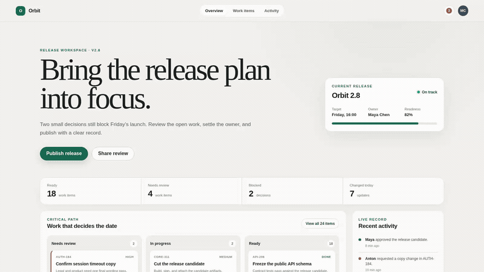

# Web Annotator for Pi

Annotate webpage elements or text, send targeted change requests to [Pi](https://pi.dev), or copy them as Markdown.

Web Annotator for Pi adds an on-page review layer to Firefox. Click an element or select text, write the change you want, and keep reviewing across reloads and page navigation. Copy one note or the whole collection for Pi, or use the optional local bridge to queue annotations in the active Pi session and see progress in Firefox.

## Features

- **Element annotations:** point at a button, card, heading, image, or other element and attach a change request.
- **Text annotations:** select a phrase or paragraph and keep the quoted text with the note.
- **Source-friendly context:** capture stable attributes, visible text, component hints when available, and a positional fallback.
- **Cross-page collections:** keep one review collection while navigating within the same site.
- **Pi-ready export:** copy one annotation or the full collection as Markdown or JSON.
- **Optional Pi workflow:** send one note, send all pending notes, or save and send in one action.
- **Live Pi status:** distinguish pending, queued, active, and completed work.
- **Keyboard workflow:** annotate, pause capture, switch modes, copy, save, and dismiss without leaving the page.
- **Local-first operation:** no account, analytics, advertising, remote code, or developer-operated service.

## Demo



[Watch the full-size MP4 recording](artwork/demo/pi-web-annotator-demo.mp4).

The repository includes a local release-planning page with stable annotation targets. Run the page, Firefox extension, and an isolated Pi session in separate terminals:

```bash
npm run demo:serve
npm run demo:browser
npm run demo:pi
```

`demo:pi` starts Pi from `demo/`, keeps the session ephemeral, ignores parent context and project resources, and enables only read, edit, and write tools. The model provider still receives annotations that you explicitly send.

Generate the four browser screenshots with the real annotation content script and a local bridge simulation:

```bash
npm run screenshots
```

Record the complete browser-to-agent flow with one public fixture annotation:

```bash
npm run demo:video
```

The video runner starts Pi in RPC mode inside a temporary copy of `demo/`, blocks file tools from leaving that workspace, sends the browser annotation through the real loopback bridge, verifies the model's file edit after reload, renders the actual RPC events beside the browser, and encodes an MP4 plus the animated README preview. This command sends one public fixture annotation to your configured model provider.

See [demo/README.md](demo/README.md) for the storyboard, exact commands, safety limits, and capture details.

## Install

### Firefox Add-ons

The signed Firefox Add-ons listing is being prepared. The AMO link will be added here after approval. The extension supports Firefox desktop only; Firefox for Android is unsupported. After the first installation, Firefox opens a welcome tab with the annotation workflow and Pi setup commands.

To test the extension before the listing is approved, follow the temporary installation steps in [CONTRIBUTING.md](CONTRIBUTING.md).

## Use

### Annotate an element

1. Enable Web Annotator for Pi from the toolbar or press `Alt+Shift+A`.
2. Hover over the page to preview the current target.
3. Click an element.
4. Write the requested change.
5. Choose **Save**, or choose **Save and send** when the Pi bridge is connected.

### Annotate text

1. Switch the panel from **Element** to **Text**, or press `Alt+T`.
2. Select text on the page.
3. Write the requested change and save it.

Text annotations use an amber highlight. Element annotations use green outlines and pins.

### Export a review

- **Copy** exports the full collection as Markdown.
- The copy button on a row exports only that annotation.
- `Alt+Shift+J` copies the collection as JSON.
- **Clear** removes the current site's collection after confirmation.

The Markdown includes page URLs, source or component hints when available, stable attributes, visible text, selected text, and a positional DOM fallback. Page-derived values are marked as untrusted reference data for the receiving agent.

## Send annotations to Pi

The Firefox extension works without Pi. To enable the local bridge, install the Pi package:

```bash
pi install npm:pi-web-annotator
```

Restart Pi, then start the bridge:

```text
/annotation-server start
```

The bridge listens on `127.0.0.1:17373`. It accepts marked extension requests from the local Firefox background script and stops with the Pi session.

The first send opens a bundled consent page. Choose **Allow sending to local Pi**, approve Firefox's optional data permission, return to the annotated page, and send again. Nothing is sent to Pi before both consent and a send action.

| Browser state | Meaning |
| --- | --- |
| Empty checkbox | The annotation is pending and ready to send. |
| Right arrow | Pi accepted and queued the annotation. |
| Spinner | Pi is working on the annotation. |
| Checked checkbox | Pi finished the annotation. |

Use **Save and send** for a new note, the arrow button for one pending row, or **Send to Pi** for all pending rows. A toast confirms queue and completion events.

Pi bridge commands:

```text
/annotation-server status
/annotation-server stop
```

For a one-off Pi run from this checkout:

```bash
pi -e ./pi-extension/index.ts
```

## Keyboard shortcuts

| Shortcut | Action |
| --- | --- |
| `Alt+Shift+A` | Toggle Web Annotator for Pi for the active tab. |
| `Alt+Shift+C` | Copy all annotations as Markdown. |
| `Alt+Shift+J` | Copy all annotations as JSON. |
| `Alt+A` | Pause or resume page capture while the panel stays open. |
| `Alt+T` | Switch between element and text mode. |
| `Ctrl+Enter` / `Cmd+Enter` | Run the primary save action: save and send when Pi is connected, otherwise save. |
| `Esc` | Cancel the open note editor. |

## Privacy

Web Annotator for Pi has no developer-operated backend and does not include analytics or advertising. Saved annotations use Firefox extension storage, isolated from page scripts. The optional Pi bridge sends selected annotation data to Pi on `127.0.0.1` after explicit Firefox consent and a send action. Pi may then send that content to the model provider configured by the user.

Annotations can contain page URLs, visible or selected text, element metadata, and your notes. Do not annotate secrets. Read [PRIVACY.md](PRIVACY.md) for storage details, permission rationale, deletion behavior, and the Pi boundary.

## Permissions

| Permission | Why it is needed |
| --- | --- |
| `activeTab` | Enables the overlay after a toolbar or keyboard action. |
| `scripting` | Injects and removes the annotation overlay in the active tab. |
| `storage` | Keeps a separate annotation collection for each website. |
| `<all_urls>` | Reinjects an already-enabled overlay after navigation and allows annotation on user-selected sites. |
| Optional `browsingActivity` | Allows page URLs to be included when the user sends annotations to local Pi. |
| Optional `websiteContent` | Allows selected text and element context to be included when the user sends annotations to local Pi. |

## Contributing

Read [CONTRIBUTING.md](CONTRIBUTING.md) before opening a pull request.

## Attribution

Web Annotator for Pi began as a Firefox port of [kuzmany/browser-annotations](https://github.com/kuzmany/browser-annotations) by Zdeno Kuzmany. This project retains and builds on the upstream product idea, overlay design, and parts of the original content-script implementation. It has since added Firefox-specific packaging and navigation, cross-page collections, source-aware and text annotations, consent and privacy controls, publishing tooling, and the optional Pi workflow.

The project is available under the [MIT License](LICENSE), which preserves the upstream and current maintainer copyright notices. See [THIRD_PARTY_NOTICES.md](THIRD_PARTY_NOTICES.md) for the upstream code attribution and licenses for development tools.
